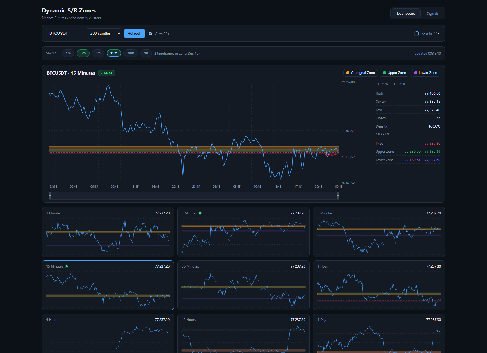
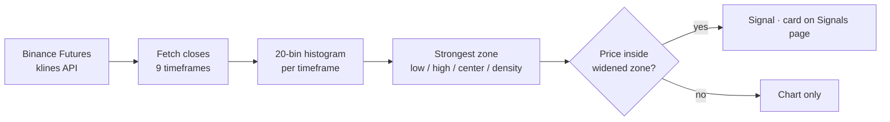
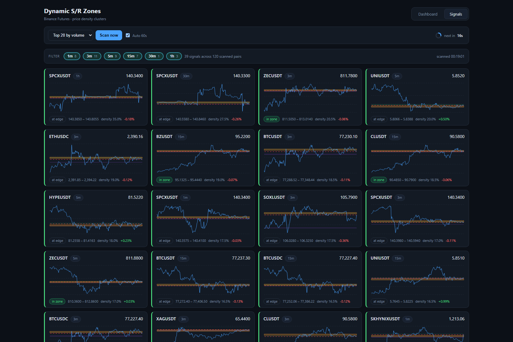

# Dynamic S/R Zones

**Price-density support & resistance zones for Binance USDT-M futures — a live React dashboard and the Python module it was ported from.**

[](https://react.dev)
[](https://vite.dev)
[](https://recharts.org)
[](https://www.python.org)

Instead of drawing trendlines, this project asks a simpler question: **where has price actually spent its time?** Closing prices are bucketed into a histogram, and the fullest bucket becomes the strongest support/resistance zone. When price returns to that zone, the pair is flagged as a signal.



---

## Contents

- [How it works](#how-it-works)
- [Features](#features)
- [Screenshots](#screenshots)
- [Quick start](#quick-start)
- [Project structure](#project-structure)
- [Configuration](#configuration)
- [Python module](#python-module)
- [Notes and limits](#notes-and-limits)

---

## How it works

The analysis is deliberately small — three steps, no indicators, no smoothing:

```
1. Fetch the last N closing prices for a timeframe (default 200 candles)
2. Split [min, max] into 20 equal-width bins and count closes per bin
   → the fullest bin is the strongest zone (low, high, center, density %)
3. Signal = 1 when the current price sits inside that zone,
   widened by one zone width on each side:

       zone.low - width  ≤  price  ≤  zone.high + width
```

Two more zones are drawn for context: the densest band **above** the current price (upper resistance) and the densest band **below** it (lower support), each computed the same way over the corresponding slice of closes.



Signals are evaluated on the six intraday timeframes (`1m`, `3m`, `5m`, `15m`, `30m`, `1h`); charts are drawn for all nine (through `4h`, `12h`, `1d`).

---

## Features

**Dashboard**

- One symbol across nine timeframes — a detail chart plus a 3×3 grid of mini charts
- Interactive charts: hover tooltips, brush zoom on the time axis, toggleable zone overlays
- Live zone statistics — bounds, center, closes in zone, density percentage
- Symbol picker with type-ahead over every USDT-M perpetual, ranked by 24h volume and showing last price and daily change
- Auto refresh with a **second-by-second countdown ring** to the next update

**Signals page**

- Scans the top 10–50 pairs by volume across all six signal timeframes in one pass
- One card per `SYMBOL + timeframe` hit, sorted by zone density, each with a sparkline, zone bounds and the distance from the zone center
- `in zone` / `at edge` tagging, per-timeframe filter chips with live counts
- Click a card to open that exact pair and timeframe on the dashboard

Requests run through a bounded worker pool, so a 50-symbol scan never fires hundreds of simultaneous requests at the API.

**About page**

- Plain-language explanation of the method, the chart colours, and what a signal does and does not mean
- Known limitations of the approach, stated up front
- Full legal disclaimer, with a short version pinned to the footer of every page

---

## Screenshots

### Signal scanner



Every card is a pair whose price has returned to its strongest density zone — here 39 hits out of 120 scanned symbol/timeframe pairs.

---

## Quick start

**Requirements:** Node.js 18+

```bash
cd web
npm install
npm run dev          # http://localhost:5173
```

```bash
npm run build        # production bundle in web/dist
npm run preview      # serve the built bundle
```

The dev server proxies `/fapi` to `https://fapi.binance.com`, so no API key, account or CORS workaround is needed — the endpoints used are public and unauthenticated.

---

## Project structure

```
.
├── docs/                                                  # screenshots
└── web/
    ├── src/
    │   ├── analysis.js          # histogram zones + signal rule (port of the Python math)
    │   ├── api.js               # Binance client, symbol list, bounded-concurrency scanner
    │   ├── constants.js         # timeframes, bin count, palette
    │   ├── format.js            # price / time / compact number formatting
    │   ├── components/
    │   │   ├── SRChart.jsx      # price line + zone overlays (full and compact variants)
    │   │   ├── SymbolPicker.jsx # type-ahead symbol search
    │   │   └── Countdown.jsx    # refresh countdown ring
    │   └── pages/
    │       ├── Dashboard.jsx    # single symbol, nine timeframes
    │       ├── Signals.jsx      # multi-symbol scanner
    │       └── About.jsx        # method explainer + full disclaimer
    └── vite.config.js           # dev proxy to the Binance futures API
```

---

## Configuration

Most tuning lives in `web/src/constants.js`:

| Constant | Default | Meaning |
| --- | --- | --- |
| `INTERVALS` | `1m … 1d` | Timeframes charted on the dashboard |
| `SIGNAL_TIMEFRAMES` | `1m … 1h` | Timeframes evaluated for signals |
| `BINS` | `20` | Histogram resolution — more bins means tighter, stricter zones |
| `APPROACH_LOOKBACK` | `30` | Lookback guard inherited from the Python module |
| `COLORS` | — | Zone and price palette shared by every chart |

Refresh cadence and scan size are set per page: `REFRESH_MS` in `Dashboard.jsx` (30s), `REFRESH_MS` and `UNIVERSE_SIZES` in `Signals.jsx` (60s, top 10–50).

---


## Notes and limits

- **Public data only.** Binance's public futures endpoints are used without authentication; no keys are stored or required.
- **Production builds call Binance directly.** The Vite proxy exists only in development, so a deployed build depends on Binance's CORS headers and the visitor's region. Put a small proxy in front of it if you host this publicly.
- **Rate limits are budgeted, not hoped for.** Binance allows 2400 request weight per minute per IP. Every response's `x-mbx-used-weight-1m` header feeds a client-side gate that stops issuing requests at 1500, and a `429`/`418` response puts the app into the cooldown the exchange asks for instead of retrying. Responses are cached per timeframe, polling pauses while the tab is hidden, in-flight requests are aborted when you switch symbols, and the manual buttons have their own cooldowns. The counter in the controls bar shows the weight used in the current minute.
- **Not financial advice.** A signal here means nothing more than "price is back inside its densest historical band". It is a context tool, not a trading system.
